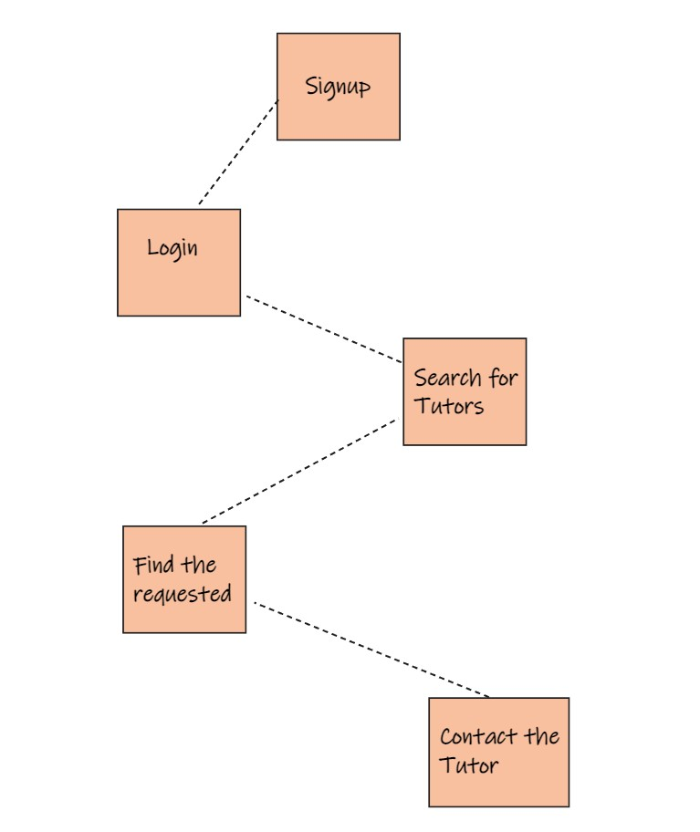

# TUTORium-Docs

`Full documentation for TUTORium WebApp`

## pitching

- To make every Tutor searchable in the world in their local area and online. To keep the website free for Tutor and students. To provide students with a Tutor within 24 hours of posting their requirements.

- Booking web app Where Tutor can post their experiences and people search for that Tutor (Vice-Versa) and then they can send and contact each other using chat system; Example, a swimming-Teacher or Math Tutor or Music Tutor searches for any student who wants posted a requested help .

- Features:

```md
1. Information should be free - People who can not afford to pay should not be forced to.
2. Ease of operation - Design user-friendly systems and improve them continuously based on your feedback.
3. The inclusion of everybody in the world - This means not only metros and big cities but also remote areas in small and developing countries.
4. Zero tolerance towards miscreants, spammers, and marketers who care about nothing but their profit.
```

## Team members

1. _Ammar Abul-Feilat_
2. _Ayat Albqoor_
3. _Diala Abul-Khail_
4. _Anas Abu Hamideh_
5. _Joud Alnsour_
6. _Ali Muhsen_

## Description

A website that let the users search for Tutors all over the world and if the users wants to register as Tutor ; he needs to sign-up and fill the requisted registration data.

## Wireframes

[WireFrames](https://www.figma.com/file/A9zoG3joO5Yb62plvSJY38/TUTORium?node-id=0%3A1)

## Users Stories

1. As a user, I want to singup in the web app, and have my own account.

2. As a user, I want to see helpful experiences.

3. As an admin, I want to have access to all API data.

4. As a user, I want to add my portfolio (experiences and certificates)

5. As a user, I want to rate Tutors that i have made contact with.

## Domain Modeling

For the front end, if the user is not signed in, he will have access to the home page, and the search page, to search for Tutors, but the non-registered user can't contact any Tutor, if the user is signed in, he will be able to access the form to contact Tutors.

When the user enters the web page, he starts by logging into our website with the username and password. this will generate an access token for the user, this will get the user's data from the first table (Users table), and will grant him the ability to add his own portfolio.

## Vision

To create web app to make the user search for a suitable Tutors and contact them.

## Scope

### in

1. The web app will provide information to the users about all the different Tutors.
2. The web app will provide contact information access to the Tutors.
3. Users will be able to "Star" their favorite Tutors.
4. Users will be able to "Rate" their Tutors.
5. Each User will Have His own portfolio whether they are Students or Tutors.

## Minimum Viable Product

1. An admin can create and delete user accounts.
2. A user can can create their own portfolio in the web app.
3. A user can search all of the Tutors in the web app.
4. A user can signin and logout.
5. deliver a good GUI.
6. Calendar system.
7. Video Chat system.

## Data Flow

A user will at first signup then search for a farm then find their suitable farm then contact with the farm owner.



## Non-Functional Requirements

1. Usability: expectations and specifications designed to ensure that a product, service, process or environment is easy to use.
2. Security: User Security consists of the platforms which protect your organisation's users, endpoints and their online activity to more efficiently correlate threats.
